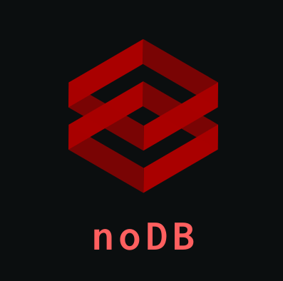
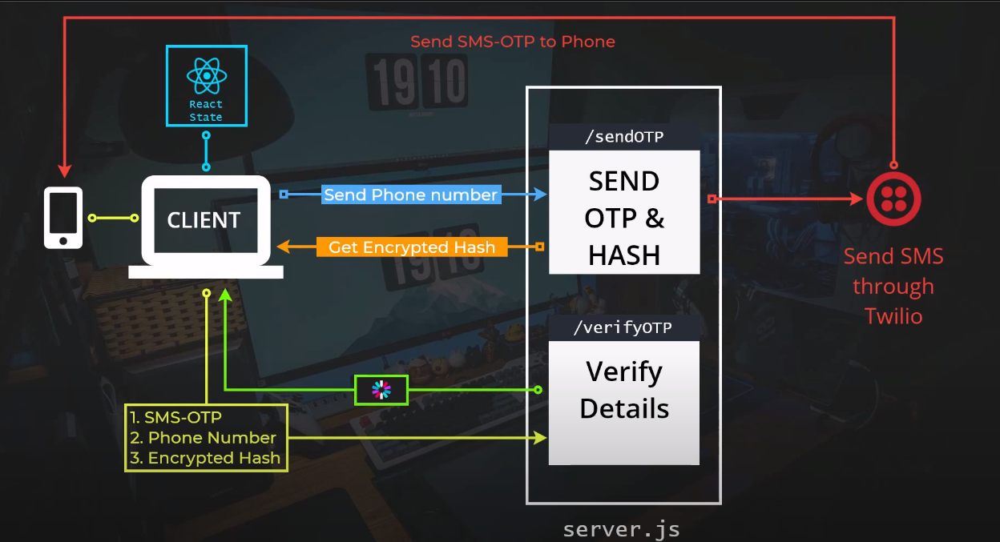
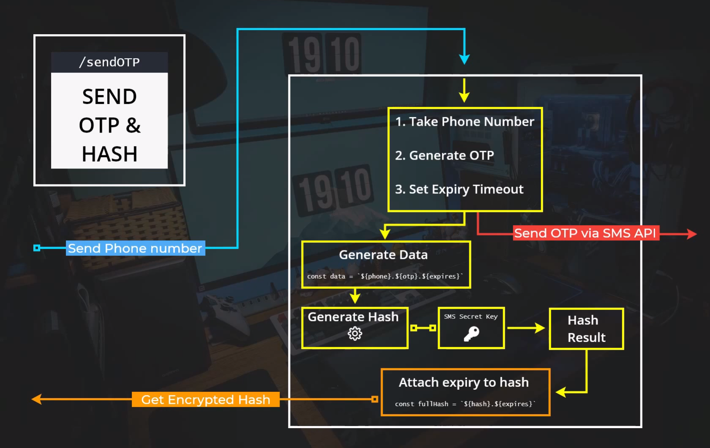
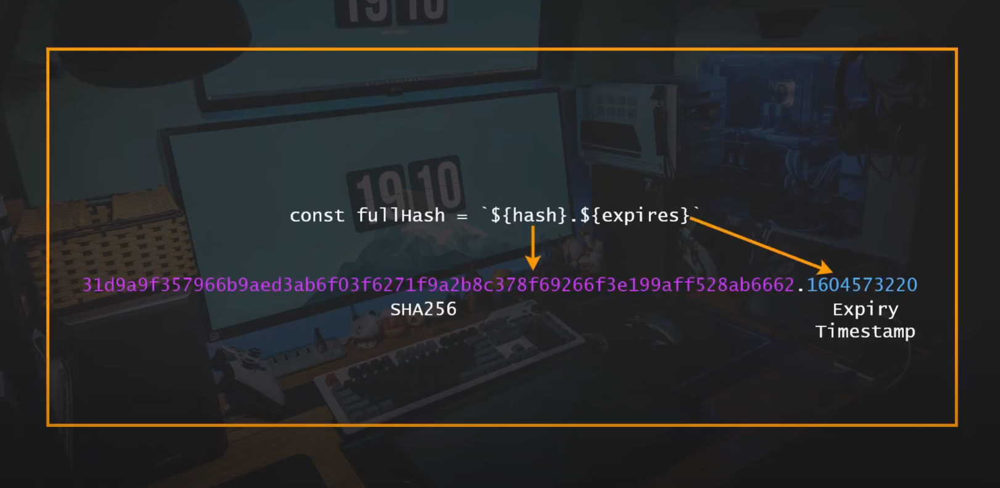
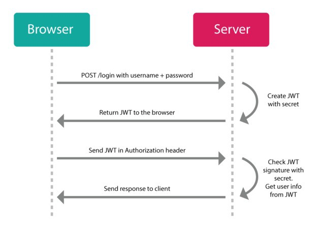
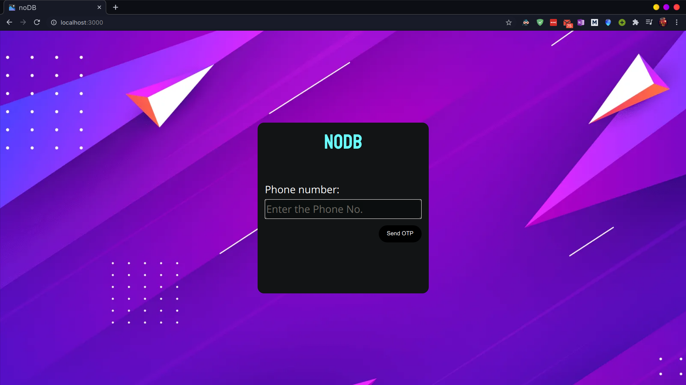
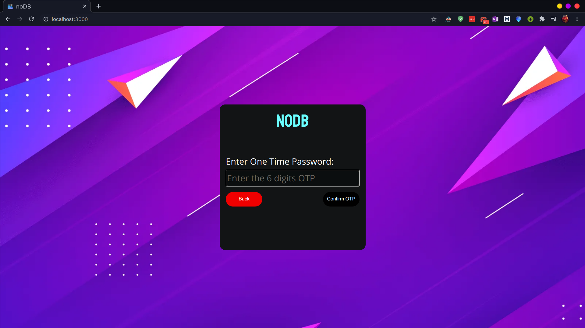

<p align="center">
  
</p>

     

##  Trivia 
Cryptographic Hashing Algorithm used : sha256 

Libraries used : webpack,express,react,axios,jwt,cors,crypto,twilio.


##  About
noDB is an implementation of passwordless authentication of user.

Achieved without using any dB,promoting horizontal scalability.
This is achieved by using the power of ```JWT(Json Web Tokens)```.

Built using ```express.js``` for server,
```React``` for frontend.

Used Twilio API for realtime OTP verification.

##  Architecture 
<h3>Overall<h1>
<p align="center">
  
</p>
<h3>Server<h1>
<p align="center">
  
</p>

</p>
<h3>HashToken<h1>
<p align="center">
  
</p>
</p>

<h3>JWT<h1>
<p align="center">
  
</p>


##  Usage
<h3>Homepage<h1>
<p align="center">
  
</p>
<h3>Verification<h1>
<p align="center">
  
</p>

</p>
<h3>Logged In/Protected Route<h1>
<p align="center">
  
</p>


###  Installation
- Install node dependencies & set your 64bit cryptographic  keys and Twilio API-key in .env variable.

```bash
$ npm install
$ npm audit fix
```


### Commands
- Start project using node-server
```bash
$ cd ./src
$ npm install
$ npm start
```

## Resources

- [JWT](https://jwt.io/)
- [Twilio Nodejs Docs](https://www.twilio.com/docs/sms/quickstart/node)


##  License
[](https://github.com/code-monk08/metroworks/blob/master/LICENSE)

# noDB
